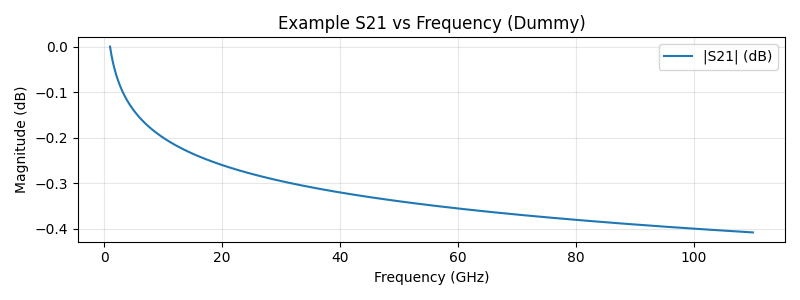

# RF Engineer Notebook (MkDocs + Material)

This is a turnkey template for an engineer‑notebook–style site published with GitHub Pages.

## Quick Start (No Coding)

1. **Create a new _public_ GitHub repository** (e.g., `rf-engineer-notebook`).
2. Download this repo as a ZIP and **upload all files** into your new repo (drag & drop in GitHub → *Add file* → *Upload files* → *Commit*).
3. Wait ~60 seconds for **Actions** to finish (check the *Actions* tab → green checkmark).
4. Go to **Settings → Pages** and set:
   - **Source:** *Deploy from a branch*
   - **Branch:** `gh-pages` and **Folder:** `/ (root)` → **Save**
5. Your site will be live at: `https://YOUR-USERNAME.github.io/YOUR-REPO/`

### Edit Content
- All pages live under `docs/`. Edit files directly on GitHub or locally.
- Add images into `docs/Images/...` and reference them like:
  ```markdown
  
  ```
- Add new pages and update navigation in `mkdocs.yml` under the `nav:` section.

### Diagrams & Math
- Mermaid: use fenced blocks with `mermaid`
- Math: use inline `$...$` or display `$$...$$` (MathJax included)

---
Made with ❤️ using [MkDocs Material](https://squidfunk.github.io/mkdocs-material/).
