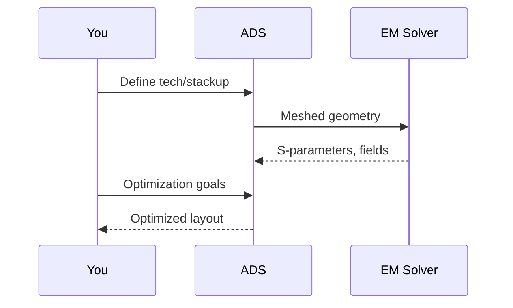

# ADS Workflow (Example)

```mermaid
sequenceDiagram
  participant U as You
  participant A as ADS
  participant E as EM Solver
  U->>A: Define tech/stackup
  A->>E: Meshed geometry
  E-->>A: S-parameters, fields
  U->>A: Optimization goals
  A-->>U: Optimized layout
```
